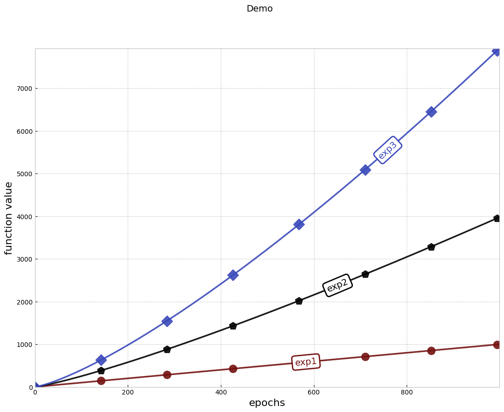

This contains code for plotting nice-looking figures for experiments and papers.

You can install this library by executing the following command in Terminal:

`pip install --upgrade git+https://github.com/IssamLaradji/PrettyPlots.git`

Run `example.py` to generate a pretty plot like the one below:

```python
from prettyplots import PrettyPlot
import numpy as np

if __name__ == "__main__":
    y1 = np.arange(1000)
    y2 = np.arange(1000) ** 1.2
    y3 = np.arange(1000) ** 1.3

    epochs = np.arange(1000)

    labels = ["exp1", "exp2", "exp3"]
    x_list = [epochs, epochs, epochs]
    y_list = [y1, y2, y3]
    
    pp = PrettyPlot(title="Demo", 
                    ylabel="function value", 
                    xlabel="epochs") 
    
    pp.plot(y_list, x_list, labels=labels)
    pp.show()
    pp.save("example")
```


